<picture>
  <source media="(max-width: 600px)" srcset="assets/hero-mobile.svg">
  
</picture>

  <a href="#-whoami">PROFILE</a> &nbsp; / &nbsp;
  <a href="#-tech_stack">STACK</a> &nbsp; / &nbsp;
  <a href="#-featured_projects">PROJECTS</a> &nbsp; / &nbsp;
  <a href="#-github_analytics">ACTIVITY</a> &nbsp; / &nbsp;
  <a href="#-connect">CONTACT</a>

## `> whoami`

I'm **Lucas Gabriel**, a **12th-year student in a vocational Computer Programming course**. My focus is software development and AI-assisted development — from the interface someone uses to the API and database behind it.

My projects currently span two different problems: checking data between business systems and finding companies to analyse their websites.

## `> tech_stack`

Knowledge I'm developing through coursework and projects — not a set of proficiency ratings.

**Programming**

**Web interfaces**

**Backend & data**

REST APIs, SQL Server, Drizzle ORM, authentication and data validation. The LCE project uses SQLite locally, with PostgreSQL/Supabase integration prepared for deployment.

**Development workflow**

AI-assisted development, automated tests, Playwright and a Docker configuration for the web project.

## `> featured_projects`

**[Kit de Validação MyTeam vs ERP](https://github.com/lucaszz7/Kit-de-Validacao-MyTeam-vs-ERP)** — a desktop tool for checking MyTeam/Sage 50 integration, comparing orders and sales, and investigating data mismatches. Built with **Python, PySide6 and SQL Server**.

**LCE Lead Search** — a web application for finding real companies through OpenStreetMap, analysing website evidence and organising opportunities with an explainable score. Built with **Next.js, React, TypeScript, Express and Drizzle**. The repository is private; deployment and paid plans are not live. **[Ask about the project](mailto:lucas.gb318@gmail.com?subject=LCE%20Lead%20Search).**

## `> github_analytics`

<strong>Open the data log — languages, activity & trophies</strong>

### Top Languages

This measures repository code, not skill level. Private projects are not included.

### Activity

<picture>
  <source media="(max-width: 600px)" srcset="assets/generated/activity-mobile.svg">
  
</picture>

### Trophies

These are automatically checked milestones, not professional awards or developer rankings.

Generated from GitHub's public APIs and visible calendar. Commits cover my owned public non-fork repositories' default branches over 365 days; PRs and issues cover my public authored items over the same period. Stars and languages cover owned public non-fork repositories. Calendar activity can include anonymised private counts if enabled on my GitHub profile, never private repository details. A failed refresh keeps the previous dated snapshot.

Dated snapshots of real GitHub data. Open the data log for metric scope.

### Contribution Snake

<picture>
  <source media="(prefers-reduced-motion: reduce)" srcset="assets/generated/activity.svg">
  
</picture>

## `> connect`

  
  
  
  

**Email:** [lucas.gb318@gmail.com](mailto:lucas.gb318@gmail.com) · **Discord:** `vulgoelice`

