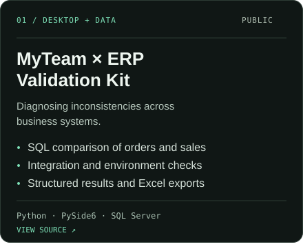
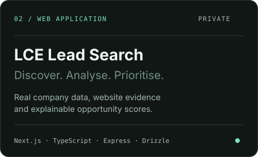
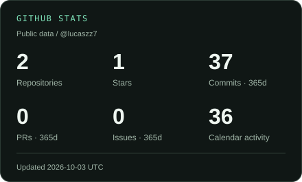
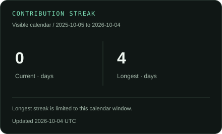
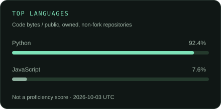
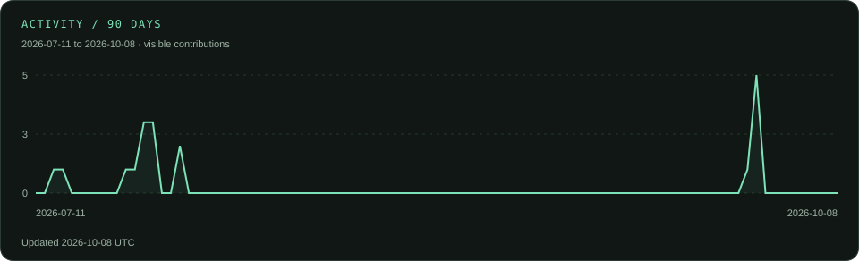
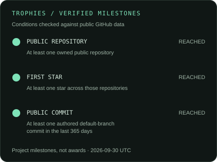
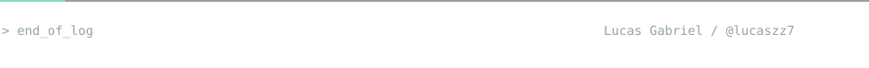

<picture>
  <source media="(max-width: 600px)" srcset="assets/hero-mobile.svg">
  
</picture>

  <a href="#about-me">ABOUT</a> &nbsp; / &nbsp;
  <a href="#selected-projects">PROJECTS</a> &nbsp; / &nbsp;
  <a href="#technical-skills">SKILLS</a> &nbsp; / &nbsp;
  <a href="#github-activity">ACTIVITY</a> &nbsp; / &nbsp;
  <a href="#contact">CONTACT</a>

## About me

I develop **desktop and full-stack web applications**, connecting user interfaces, APIs and databases. My work focuses on **data validation, business-system integration and tools that turn information into useful decisions**.

I'm currently in the **12th year of a vocational Computer Programming course**. My foundation includes **C++, Python and Java**, with practical project work in **TypeScript, React, Next.js and SQL**.

**Technical focus**

- **Application development** — desktop interfaces and responsive web applications, from the frontend to backend logic.
- **Data & integrations** — relational databases, REST APIs, cross-system validation and structured reporting.
- **Development workflow** — Git, automated testing and AI-assisted development, supported by code review and verification.

## Selected projects

**[MyTeam × ERP Validation Kit](https://github.com/lucaszz7/Kit-de-Validacao-MyTeam-vs-ERP)** 
The application compares business documents across MyTeam, BackOffice and Sage 50, with checks for seller mappings and service configuration. SQL-backed results are presented through PySide6 and exported to Excel for investigation. 
**Engineering focus:** cross-system reconciliation · relational queries · diagnostic workflows.

**LCE Lead Search** 
Company retrieval, website auditing and scoring are separated into services. Search history is isolated by account, and website requests validate destinations and redirects to mitigate SSRF. Missing source data remains unknown instead of becoming a fabricated result. 
**Engineering focus:** modular services · API integration · account data isolation · safe HTTP retrieval. 
Private repository · functional locally · public deployment pending. <a href="mailto:lucas.gb318@gmail.com?subject=LCE%20Lead%20Search">Request project details ↗</a>

## Technical skills

### Programming foundations

**C++ · Python · Java · TypeScript · JavaScript** 
Programming fundamentals, application logic and data processing.

### Frontend & desktop interfaces

**React · Next.js · HTML · CSS · Tailwind CSS · PySide6** 
Responsive web interfaces, reusable components and Python desktop applications.

### Backend, APIs & databases

**Node.js · Express · REST APIs · SQL Server · SQLite · Drizzle ORM** 
API integration, authentication, relational data modelling and persistence. PostgreSQL/Supabase integration is prepared in LCE for deployment.

### Tools & development practices

**Git · GitHub · GitHub Actions · Playwright · AI-assisted development** 
Version control, automated checks and browser testing. The web project also includes a Docker configuration for deployment.

## GitHub activity

Public repositories, contribution history and language breakdown.

<strong>View GitHub statistics and contribution activity</strong>

 

### Languages & activity

<picture>
  <source media="(max-width: 600px)" srcset="assets/generated/activity-mobile.svg">
  
</picture>

### Repository milestones

### Contribution calendar

<picture>
  <source media="(prefers-reduced-motion: reduce)" srcset="assets/generated/activity.svg">
  
</picture>

Snapshots generated from GitHub's public APIs and visible calendar, with dates printed on the cards. Commits cover owned public non-fork repositories' default branches over 365 days; PRs and issues cover public authored items over the same period. Stars and languages cover owned public non-fork repositories. Language share measures repository code, not proficiency. Calendar activity can include anonymised private counts if enabled on the profile, never private repository details. Milestones are checked conditions, not awards. A failed refresh keeps the previous snapshot.

## Contact

For project details and technical enquiries:

  
  
  

**Email:** [lucas.gb318@gmail.com](mailto:lucas.gb318@gmail.com) 
**Discord:** `vulgoelice`

